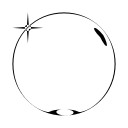
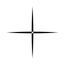
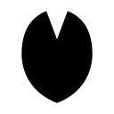

# assets

`assets` is a namespace that groups named resources by category.

## Available Namespaces

### `assets.colors`

Named ASS colors grouped by shade.

```ass
{\1c!assets.colors.red[500]!}
```

Available color names:

`slate`, `gray`, `zinc`, `neutral`, `stone`, `red`, `orange`, `amber`,
`yellow`, `lime`, `green`, `emerald`, `teal`, `cyan`, `sky`, `blue`,
`indigo`, `violet`, `purple`, `fuchsia`, `pink`, `rose`.

Available shades:

`50`, `100`, `200`, `300`, `400`, `500`, `600`, `700`, `800`, `900`, `950`.

### `assets.shapes`

Named ASS drawing strings that can be used in `\p` drawings or passed to
shape helpers.

```ass
{\p1}!assets.shapes.star!{\p0}
```

```ass
{\p1}!shape.rotate(assets.shapes.star, 25)!{\p0}
```

#### Shape gallery

**Basic**

<table><tr>
<td align="center"><br/><code>circle</code></td>
<td align="center"><br/><code>triangle</code></td>
<td align="center"><br/><code>rectangle</code></td>
<td align="center"><br/><code>circangle</code></td>
<td align="center"><br/><code>pentagon</code></td>
<td align="center"><br/><code>hexagon</code></td>
<td align="center"><br/><code>octagon</code></td>
<td align="center"><br/><code>diamond</code></td>
</tr><tr>
<td align="center"><br/><code>pixel</code></td>
<td align="center"><br/><code>gear</code></td>
<td align="center"><br/><code>bubble</code></td>
<td align="center"><br/><code>trebol</code></td>
</tr></table>

**Hearts**

<table><tr>
<td align="center"><br/><code>heart</code></td>
<td align="center"><br/><code>heart2t</code></td>
<td align="center"><br/><code>heart_b</code></td>
</tr></table>

**Shines**

<table><tr>
<td align="center"><br/><code>shine1t</code></td>
<td align="center"><br/><code>shine2t</code></td>
<td align="center"><br/><code>shine3t</code></td>
<td align="center"><br/><code>shine4t</code></td>
</tr></table>

**Feathers**

<table><tr>
<td align="center"><br/><code>feather</code></td>
<td align="center"><br/><code>feather2</code></td>
</tr></table>

**Music notes**

<table><tr>
<td align="center"><br/><code>note1t</code></td>
<td align="center"><br/><code>note2t</code></td>
<td align="center"><br/><code>note3t</code></td>
<td align="center"><br/><code>note4t</code></td>
</tr></table>

**Stars**

<table><tr>
<td align="center"><br/><code>star</code></td>
<td align="center"><br/><code>star1t</code></td>
<td align="center"><br/><code>star2t</code></td>
<td align="center"><br/><code>star3t</code></td>
<td align="center"><br/><code>star4t</code></td>
<td align="center"><br/><code>star5t</code></td>
<td align="center"><br/><code>star6t</code></td>
<td align="center"><br/><code>star7t</code></td>
</tr><tr>
<td align="center"><br/><code>star8t</code></td>
<td align="center"><br/><code>star9t</code></td>
<td align="center"><br/><code>star10t</code></td>
</tr></table>

**Sakura**

<table><tr>
<td align="center"><br/><code>sakura</code></td>
<td align="center"><br/><code>sakura1t</code></td>
<td align="center"><br/><code>sakura2t</code></td>
<td align="center"><br/><code>sakura3t</code></td>
<td align="center"><br/><code>sakura4t</code></td>
<td align="center"><br/><code>sakura5t</code></td>
<td align="center"><br/><code>sakura6t</code></td>
<td align="center"><br/><code>sakura7t</code></td>
</tr></table>

**Snow**

<table><tr>
<td align="center"><br/><code>snow1t</code></td>
<td align="center"><br/><code>snow2t</code></td>
<td align="center"><br/><code>snow3t</code></td>
</tr></table>

**Flowers**

<table><tr>
<td align="center"><br/><code>flower1t</code></td>
<td align="center"><br/><code>flower2t</code></td>
<td align="center"><br/><code>flower3t</code></td>
<td align="center"><br/><code>flower4t</code></td>
<td align="center"><br/><code>flower5t</code></td>
<td align="center"><br/><code>flower6t</code></td>
<td align="center"><br/><code>flower7t</code></td>
<td align="center"><br/><code>flower8t</code></td>
</tr><tr>
<td align="center"><br/><code>flower9t</code></td>
<td align="center"><br/><code>flower10t</code></td>
<td align="center"><br/><code>flower11t</code></td>
<td align="center"><br/><code>flower12t</code></td>
<td align="center"><br/><code>flower13t</code></td>
<td align="center"><br/><code>flower14t</code></td>
<td align="center"><br/><code>flower15t</code></td>
<td align="center"><br/><code>flower16t</code></td>
</tr><tr>
<td align="center"><br/><code>flower17t</code></td>
<td align="center"><br/><code>flower18t</code></td>
<td align="center"><br/><code>flower19t</code></td>
<td align="center"><br/><code>flower20t</code></td>
<td align="center"><br/><code>flower21t</code></td>
<td align="center"><br/><code>flower22t</code></td>
<td align="center"><br/><code>flower23t</code></td>
<td align="center"><br/><code>flower24t</code></td>
</tr><tr>
<td align="center"><br/><code>flower25t</code></td>
<td align="center"><br/><code>flower26t</code></td>
<td align="center"><br/><code>flower27t</code></td>
<td align="center"><br/><code>flower28t</code></td>
<td align="center"><br/><code>flower29t</code></td>
</tr></table>

**Geometric / abstract**

<table><tr>
<td align="center"><br/><code>cristal17</code></td>
<td align="center"><br/><code>geometric10</code></td>
<td align="center"><br/><code>diagonal13r</code></td>
<td align="center"><br/><code>diagonal13l</code></td>
</tr></table>

Use [`shape`](./shape.md) for geometry operations on drawing strings.
